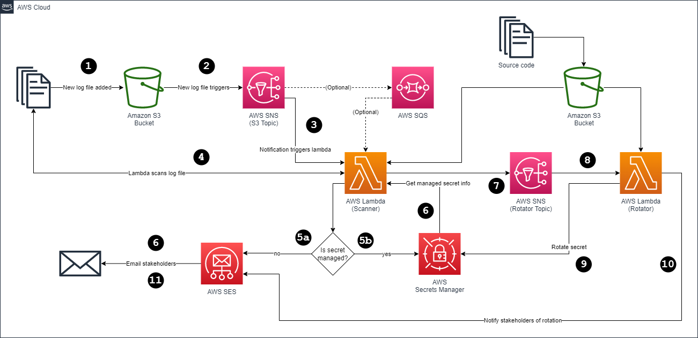

# secrets-monitor-aws

This repository contains Terraform code to deploy an example secret and its custom rotation Lambda function.

## Architecture



_Note: Only the secret and it's Lambda function (and IAM role) are managed at this time._

### Notes

1. Log files should at least be separated per application by using S3 bucket key prefixes, i.e. prod/frontend, prod/backend, ext-github, etc., and each should have it's own SNS topic.
1. Assuming #1, SNS topics can provide the scanner Lambda function with info of the log source, and therefore dynamically assign `lambda_function.set_secret()` per application.
1. The Lambda function code can use `re.compile` with a list of regular expressions managed in a separate python module to speed up checking against large files with many lines of logs.

    ```python
    # expressions.py
    patterns = [
        # Social Security Numbers
        "(?!666|000|9\\d{2})\\d{3}-(?!00)\\d{2}-(?!0{4})\\d{4}",
        # US Phone Numbers
        "\([2-9][\d]{2}\) [\d]{3}-[\d]{4}",  # (nnn) nnn-nnn
    ]

    # lambda_function.py
    from expressions import patterns
    ...
    regex = re.compile('|'.join(patterns))
    for line in log_lines:
        if regex.search(line):
            ...
    ...
    ```

## Usage

1. First, ensure that the rotation lambda source repository is adjacent to this one:

    ```sh
    $ tree
    code/
    ├── secrets-monitor      # https://github.com/craigsands/secrets-monitor
    └── secrets-monitor-aws  # https://github.com/craigsands/secrets-monitor-aws
    ```

1. Then set AWS access and deploy:

    ```
    export AWS_ACCESS_KEY_ID=<access-key>
    export AWS_SECRET_ACCESS_KEY=<secret-access-key>
    export AWS_DEFAULT_REGION=us-east-1

    terraform init
    terraform apply
    ```

## Notes

1. This repository is based on AWS' user guide for secret rotation: https://docs.aws.amazon.com/secretsmanager/latest/userguide/rotating-secrets.html#rotate-secrets_how
1. Although I tend to trust AWS-recommended methods, new secrets are generated using the [secrets](https://docs.python.org/3/library/secrets.html) module of the python standard library since documentation was sparse on [secretsmanager.get_random_password()](https://boto3.amazonaws.com/v1/documentation/api/latest/reference/services/secretsmanager/client/get_random_password.html)'s cryptographic security.
1. Since the AWS-provided rotation code requires `secretsmanager:GetSecretValue` in the Lambda function's execution role policy, the tag condition `aws:ResourceTag/AllowMonitor=true]` was used to prevent access to secrets that are not intended to be rotated automatically.